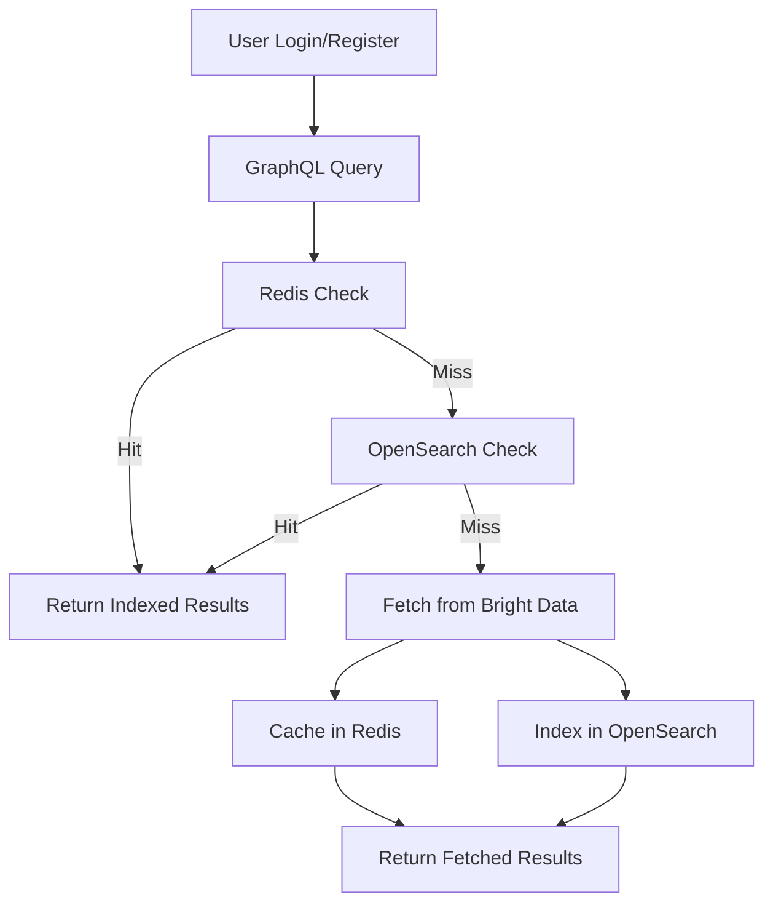

# Product Prices Aggregator API

This project is a GraphQL API designed for aggregating product prices, monitoring competitor prices, fetching product
details from the Bright Data API, and managing user authentication. The system incorporates caching with Redis, indexing
with OpenSearch, and notification services via Kafka.

---

## Features

- Fetch product data from Bright Data.
- Cache results in Redis for faster subsequent access.
- Index product data in OpenSearch for efficient search.
- Provide GraphQL queries for searching products.
- Notify users when price thresholds are met.
- User authentication with JWT-based login and role-based access.

---

## Technologies

- **NestJS**: Framework for building the application.
- **Redis**: Caching mechanism.
- **OpenSearch**: Indexing and searching product data.
- **Bright Data API**: Fetch product data.
- **Kafka**: Notification service.
- **GraphQL**: API interface.
- **JWT**: Authentication mechanism.

---

## Setup Instructions

### Prerequisites

- Node.js
- Redis
- OpenSearch
- Kafka broker
- Bright Data API credentials

### Environment Variables

Create a `.env` file in the root directory:

```env
AMAZON_API_URL=https://api.brightdata.com
AMAZON_API_TOKEN=<your_bright_data_token>
REDIS_URL=redis://localhost:6379
OPEN_SEARCH_URL=https://your-opensearch-url
OPEN_SEARCH_USERNAME=<your_opensearch_username>
OPEN_SEARCH_PASSWORD=<your_opensearch_password>
KAFKA_BROKER=<your_kafka_broker>
JWT_SECRET=<your_jwt_secret>
JWT_EXPIRES_IN=3600
```

### Installation

1. Clone the repository:
   ```bash
   git clone <repository_url>
   cd product-prices-aggregator-api
   ```

2. Install dependencies:
   ```bash
   npm install
   ```

3. Start Redis and OpenSearch services.

4. Run the application:
   ```bash
   npm run start:dev
   ```

---

## Project Structure

```
src/
├── amazon
│   ├── amazon.module.ts
│   ├── amazon.service.ts
├── auth
│   ├── auth.module.ts
│   ├── auth.service.ts
│   ├── auth.resolver.ts
│   ├── jwt.strategy.ts
│   ├── gql-auth.guard.ts
├── bright-data
│   ├── bright-data.service.ts
├── notifications
│   ├── notifications.module.ts
│   ├── notifications.service.ts
├── product
│   ├── product.module.ts
│   ├── product.service.ts
│   ├── product.resolver.ts
├── redis
│   ├── redis.module.ts
│   ├── redis.service.ts
├── search
│   ├── search.module.ts
│   ├── search.service.ts
├── app.module.ts
```

---

## API Endpoints

### GraphQL Queries

#### 1. Search Products by Title

```graphql
query {
    searchProductsByTitle(title: "smart watch") {
        title
        price
        url
    }
}
```

#### 2. Fetch Products by Keywords

```graphql
query {
    fetchProductsByKeywords(keywords: "smart watch", pagesToSearch: 2) {
        title
        price
        url
    }
}
```

#### 3. Notify Price Drop

```graphql
mutation {
    notifyPriceDrop(
        product: {
            title: "smart watch",
            price: 199.99,
            url: "https://www.amazon.com/smart-watch"
        },
        userId: "user123",
        threshold: 200
    )
}
```

#### 4. Register User

```graphql
mutation {
    registerUser(input: {
        username: "testuser",
        email: "testuser@example.com",
        password: "securepassword"
    }) {
        id
        username
        email
    }
}
```

#### 5. Login User

```graphql
mutation {
    loginUser(input: {
        email: "testuser@example.com",
        password: "securepassword"
    }) {
        accessToken
    }
}
```

---

## Flow of Data

### Description

1. **Authentication**: User logs in or registers via the GraphQL API.
2. **Client Query**: A user queries for product data via GraphQL.
3. **Redis Check**: The system checks Redis for cached results.
4. **OpenSearch Check**: If not in Redis, it checks OpenSearch.
5. **Bright Data API**: If not in OpenSearch, it fetches data from Bright Data.
6. **Cache and Index**: The fetched data is cached in Redis and indexed in OpenSearch.
7. **Response**: The system returns the results to the client.

### Mermaid Flowchart



---

## Key Services

### **AuthService**

Handles user authentication and authorization.

#### Methods:

- `registerUser(input: CreateUserInput): Promise<User>`
- `loginUser(input: LoginUserInput): Promise<{ accessToken: string }>`

### **AmazonService**

Handles interactions with the Bright Data API.

#### Methods:

- `fetchProducts(keywords: string, domain: string, pagesToSearch: number): Promise<any[]>`
- `getCachedProducts(keywords: string): Promise<any[]>`
- `cacheProducts(keywords: string, products: any[]): Promise<void>`

### **SearchService**

Manages OpenSearch interactions.

#### Methods:

- `searchByTitle(title: string): Promise<any[]>`
- `indexProduct(product: any): Promise<void>`

### **NotificationsService**

Handles user notifications via Kafka.

#### Methods:

- `sendNotification(type: string, payload: any): Promise<void>`

### **BrightDataService**

Handles Bright Data API interactions.

#### Methods:

- `triggerDataCollection(inputs: any[]): Promise<string>`
- `fetchData(snapshotId: string): Promise<any[]>`

---

## Deployment

### Docker Image

The application is published as a Docker image and can be pulled using the following command:

```bash
docker pull ghcr.io/muthuri-dev/product-price-aggregator-api:0.1
```

---

## Future Enhancements

- Integrate real-time data updates using WebSockets.
- Add user role management for fine-grained access control.
- Enhance notification system for real-time updates.

---

## License

This project is licensed under the MIT License.

---

## Contributing

Contributions are welcome! Please fork the repository and submit a pull request.

---

For any questions, feel free to contact.

